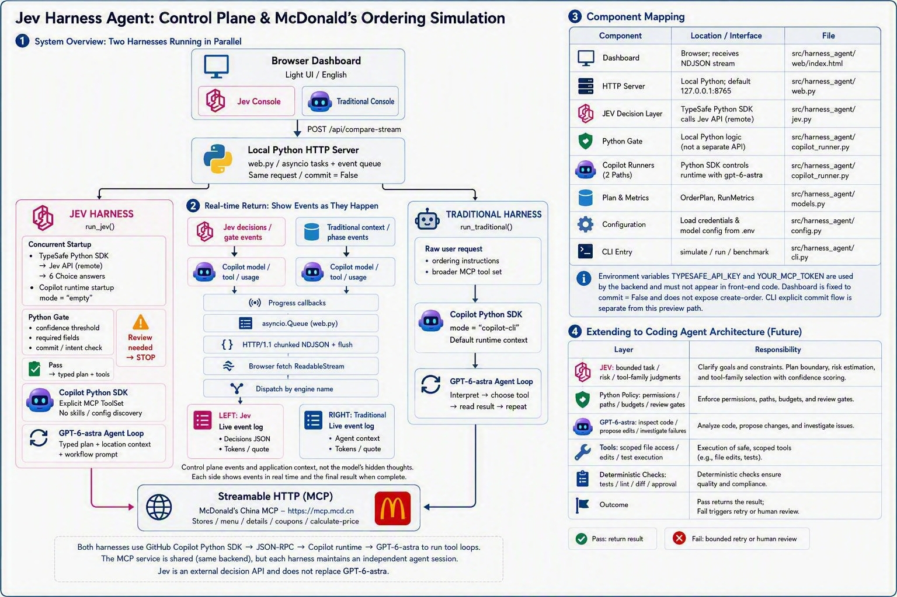

# Jev Harness Agent: Coding Agent Control Plane and McDonald's Ordering Demo

**English** | [简体中文](README.zh.md)



This project compares two agent harnesses:

- **Traditional Harness**: GitHub Copilot Python SDK with `gpt-6-astra` interprets the request, selects tools, and calls McDonald's China MCP through an agent loop.
- **Jev Harness**: TypeSafe Jev first produces typed decisions with confidence scores. Local Python code applies gates and narrows tool access, then delegates MCP execution to the same `gpt-6-astra` model.

The default CLI request, expressed in Chinese, asks for:

> One grilled chicken burger combo with a medium Coke, for pickup. Calculate the price first; do not place an order.

The light-only dashboard supports English, Simplified Chinese, and Traditional Chinese, with two live consoles for concurrent comparison.

## Architecture

### System overview: two parallel harnesses

All diagrams use Markdown `text` blocks. No Mermaid or diagram plugin is required.

```text
                  +-----------------------------------------+
                  | Browser Dashboard                       |
                  | Light UI / English / zh-CN / zh-TW       |
                  | Jev console | Traditional console       |
                  +--------------------+--------------------+
                                       |
                             POST /api/compare-stream
                                       |
                  +--------------------v--------------------+
                  | Local Python HTTP Server                |
                  | web.py / asyncio tasks + event queue    |
                  | Same request / commit=False             |
                  +----------+-------------------+----------+
                             |                   |
               +-------------+                   +-------------+
               |                                               |
  +------------v------------------+          +------------------v------------+
  | JEV HARNESS                   |          | TRADITIONAL HARNESS           |
  | run_jev()                     |          | run_traditional()             |
  +-------------------------------+          +-------------------------------+
  | Concurrent startup:           |          | Raw request                   |
  | TypeSafe SDK -> remote Jev API |          | + ordering instructions       |
  | Copilot runtime (empty mode)  |          | + broader MCP tool set        |
  +-------------------------------+          +-------------------------------+
  | Six Choice answers            |          | Copilot Python SDK            |
  | -> typed plan + confidence    |          | mode="copilot-cli"            |
  +-------------------------------+          | Default runtime context       |
  | Local Python gate             |          +-------------------------------+
  | - confidence / required data  |          | GPT-6-astra agent loop        |
  | - commit / intent check       |          | Interpret -> choose tool      |
  | Review needed -> STOP         |          | -> read result -> repeat      |
  | Pass -> plan + allowed tools  |          +----------------+--------------+
  +-------------------------------+                           |
  | Copilot Python SDK            |                           |
  | Explicit MCP ToolSet          |                           |
  | No skills / config discovery  |                           |
  +-------------------------------+                           |
  | GPT-6-astra agent loop        |                           |
  | Typed plan + location context |                           |
  | + workflow prompt             |                           |
  +---------------+---------------+                           |
                  |                                           |
                  +--------------------+----------------------+
                                       |
                            Streamable HTTP (MCP)
                                       |
                  +--------------------v--------------------+
                  | McDonald's China MCP                    |
                  | https://mcp.mcd.cn                       |
                  | Stores / menu / details / coupons       |
                  | calculate-price                         |
                  +-----------------------------------------+
```

Both paths use **GitHub Copilot Python SDK → JSON-RPC → Copilot runtime → GPT-6-astra** for tool execution. The shared MCP box represents the same remote service, not a shared agent session. Jev is an additional remote decision API; it does not replace GPT-6-astra.

### Live updates: stream events without waiting for both runs

```text
  Jev decisions / gate events       Traditional context / phase events
               |                                  |
  Copilot model / tool / usage       Copilot model / tool / usage
               |                                  |
               +----------------+-----------------+
                                |
                         Progress callbacks
                                |
                     asyncio.Queue (web.py)
                                |
                 HTTP/1.1 chunked NDJSON + flush
                                |
                   Browser fetch ReadableStream
                                |
                      Dispatch by engine name
                                |
                 +--------------+--------------+
                 |                             |
      +----------v-----------+      +----------v-----------+
      | LEFT: Jev            |      | RIGHT: Traditional   |
      | Live event log       |      | Live event log       |
      | Decisions JSON       |      | Agent context        |
      | Tokens / quote       |      | Tokens / quote       |
      +----------------------+      +----------------------+
```

Consoles append progress as it arrives; each result panel appears when its run finishes. These are execution events and application-supplied context, not hidden model reasoning.

### Components and source files

| Component | Runtime / interface | Source |
|---|---|---|
| Dual-console dashboard | Browser; consumes NDJSON | `src/harness_agent/web/index.html` |
| HTTP server and concurrency | Local Python; default `127.0.0.1:8765` | `src/harness_agent/web.py` |
| Jev decisions | TypeSafe Python SDK calling the remote Jev API | `src/harness_agent/jev.py` |
| Python gate and tool allowlist | Local Python logic, not a separate API or CLI | `src/harness_agent/copilot_runner.py` |
| Copilot execution paths | SDK-controlled runtime with `gpt-6-astra` | `src/harness_agent/copilot_runner.py` |
| Plans and metrics | `OrderPlan`, `RunMetrics` | `src/harness_agent/models.py` |
| Local configuration | Credentials and model settings from `.env` | `src/harness_agent/config.py` |
| CLI entry point | `simulate`, `run`, `benchmark` | `src/harness_agent/cli.py` |

The backend uses `TYPESAFE_API_KEY` and `YOUR_MCP_TOKEN` from `.env`; do not embed them in browser code. The dashboard always uses `commit=False` and does not expose `create-order`. Explicit CLI submission is separate from this preview path.

### Extension to coding agents

The following is a proposed extension, not an implemented end-to-end coding agent:

```text
  Coding request
       |
       v
  Jev: bounded task / risk / tool-family judgments
       |
       v
  Python policy: permissions / paths / budgets / review gates
       |
       v
  GPT-6-astra: inspect code / propose edits / investigate failures
       |
       v
  Tools: scoped file access / edits / test execution
       |
       v
  Deterministic checks: tests / lint / diff / approval
       |
       +--> Pass: return result
       +--> Fail: bounded retry or human review
```

| Layer | Proposed coding-agent responsibility |
|---|---|
| Jev / System One | Classify task type, change risk, required tool families, and review needs |
| Code control plane | Enforce confidence thresholds, permissions, budgets, iteration limits, allowed paths, and side-effect gates |
| GPT-6-astra | Generate text/code, reason across files, and investigate failures |
| MCP / local tools | Read, edit, test, and query services within the permitted scope |
| Validators | Check schemas, diffs, tests, lint, and secrets; return results to code-controlled policy |

Jev is not a code generator or an autonomous agent loop. In the current project, Python enforces initial gates and tool filtering; GPT-6-astra still selects subsequent calls and arguments. A fully enforced state machine, code validation, and bounded retries are extension ideas, not existing capabilities.

## Ordering workflow

```text
  User request: grilled chicken combo / Coke / pickup / quote only
       |
       v
  Jev: one request, six Choice questions evaluated in parallel
       |
       +--> fulfillment / meal / size / drink / quantity / action
       +--> confidence / probabilities
       |
       v
  Python gate
       |
       +--> Missing required information or low confidence: STOP
       |
       +--> Pass: OrderPlan + location context + allowed tools
                    |
                    v
            Copilot GPT-6-astra
                    |
                    v
            query-nearby-stores
                    |
             +------+-------------------+
             |                          |
             v                          v
         query-meals            query-store-coupons
             |                          |
             v                          |
         query-meal-detail              |
             |                          |
             +-------------+------------+
                           |
                           v
                     calculate-price
                           |
                           v
                Quote + usage + event metrics
                           |
                           v
                 Dashboard / CLI output

  Dashboard preview: create-order is NOT exposed.
```

This diagram describes pickup data dependencies, not a code-enforced execution sequence. Menu and coupon lookups can be independent once the store is known; actual parallelism depends on the agent's tool calls.

Jev evaluates six fields in one request. If the minimum confidence is below `JEV_CONFIDENCE_THRESHOLD`, or fulfillment, meal, or drink information is missing, execution stops before MCP calls. MCP/code handles price calculation, not Jev.

The Jev path starts an isolated Copilot SDK `empty` runtime concurrently with classification. It disables session storage, skills, configuration discovery, and custom instructions, and explicitly allows the selected MCP tools. Large menu results remain inline to avoid reintroducing file-reading tools; this also increases context size for large responses.

## Comparison with the traditional harness

| Aspect | Traditional: Copilot + GPT-6-astra | Jev + Python + Copilot |
|---|---|---|
| Control flow | Model chooses the next step in an agent loop | Python gates and filters tools first; model still executes the workflow prompt |
| Intent and parameters | Generative model interprets the request | Jev produces closed-set decisions in one parallel request |
| Tool exposure | Broader read-only ordering tool set in preview | Narrowed by the plan; pickup does not expose delivery-address tools |
| Uncertainty | No separate typed confidence stage in this demo | Choice distributions and confidence support threshold checks |
| Type safety | Tool arguments still need runtime validation | Jev decisions use declared options; MCP arguments still need validation |
| Generation | Suitable for text, code, and complex investigation | Jev does not generate prose; GPT-6-astra remains the generative executor |
| Latency | Repeated model/tool rounds | Adds classification, but narrows the subsequent runtime and workflow |
| Execution boundaries | Depends on runtime permissions and tool configuration | Additional local gates and an explicit MCP ToolSet constrain execution |

**Do not apply TypeSafe's published 193.6× / 444.6× figures directly to this demo.** Those describe its specific workflow evaluations, not this application's end-to-end performance. The CLI `benchmark` runs both harnesses sequentially; the dashboard runs them concurrently. Neither a single run nor a live race establishes statistically reliable speedups.

Jev is not guaranteed to make the workflow faster. Runtime, context, output length, network conditions, and MCP latency also matter. Many runtime optimizations can be applied to the traditional path too.

## Installation and usage

Use Python 3.11+ and the Microsoft package feed proxy:

```bash
python3.11 -m venv .venv
source .venv/bin/activate
python -m pip install \
  --index-url https://packagefeedproxy.microsoft.io/pypi/simple \
  -e ".[dev]"
python -m copilot download-runtime
```

When this example was created, the proxy supplied `typesafe-sdk 0.5.7`. The project therefore uses the cookbook-supported minimum `>=0.5.7`; pip can select a compatible newer release when available. Live Copilot runs also require valid GitHub Copilot authentication and access to `gpt-6-astra`.

Replace the placeholders in your local `.env`:

```dotenv
YOUR_MCP_TOKEN=YOUR_MCP_TOKEN
TYPESAFE_API_KEY=YOUR_TYPESAFE_API_KEY
MCD_MCP_URL=https://mcp.mcd.cn
COPILOT_MODEL=gpt-6-astra
TYPESAFE_MODEL=jev-latest
JEV_CONFIDENCE_THRESHOLD=0.75
```

Obtain `YOUR_MCP_TOKEN` from the McDonald's China MCP console. The application sends it using Bearer authentication in the HTTP Authorization header. `.env` is excluded by `.gitignore`.

Run the offline, side-effect-free workflow illustration:

```bash
harness-agent simulate
```

Connect to the real MCP service for queries and quotes only:

```bash
harness-agent run --engine traditional
harness-agent run --engine jev
harness-agent benchmark
```

Start the local dashboard for concurrent execution:

```bash
harness-dashboard
```

Open `http://127.0.0.1:8765`. The page provides no order-submission control. Supply a location if needed to find a pickup store.

Live result JSON includes:

- `steps`: a summary of the harness workflow, not a chronological tool-call trace.
- `jev_decisions`: Choice answers, confidence, probability distributions, gate results, and the typed plan.
- `agent_context`: application prompt, model, and MCP allowlist; no credential fields. This is not the runtime's complete internal context.
- `token_usage`: Jev and per-call Copilot input/output/cache usage, totals, and SDK-reported cost.
- `event_types`: counts of SDK session/model/tool events.

Explicit `--commit` enables submission and **may create a real order**. It is not required for the dashboard or benchmarks:

```bash
harness-agent run --engine jev \
  --request "I want one grilled chicken burger combo with a medium Coke for pickup. I confirm that an order should be created." \
  --commit
```

## Evaluation

Save each run's JSON and compare:

1. **Correctness**: requested meal, size, drink, quantity, fulfillment, discount eligibility, and final quote.
2. **Efficiency**: end-to-end p50/p95, model stages, observed model-call/usage events, and tool execution counts. `model_stages` describes architectural stages, not actual model request counts.
3. **Reliability**: review-gate outcomes, invalid arguments, retries, and unauthorized side effects.
4. **Cost**: reported token usage, cache behavior, and actual provider billing—not elapsed time alone.

`tool_events` currently counts `TOOL_EXECUTION_START` events. It is not a count of streaming deltas and should not be treated as exclusively MCP calls without identifying the actual tools.

Input tokens are cumulative across model rounds, including repeated context and cache-related usage. Do not treat SDK `cost` as a currency amount without verifying its billing semantics. Check whether usage fields are reported before interpreting totals.

For a meaningful benchmark, fix task and success criteria, warm up, repeat runs, alternate execution order, and compare only completed quotes. To isolate Jev's contribution, include an equally optimized non-Jev baseline.

## References

- [TypeSafe: Introducing System One Models & Jev](https://typesafe.ai/blog/introducing-system-one-models-and-jev)
- [TypeSafe Python SDK quickstart](https://docs.typesafe.ai/introduction/quickstart)
- [TypeSafe: How to build with System One](https://docs.typesafe.ai/concepts/how-to-build-with-system-one)
- [TypeSafe: Jev 1.13 jaggedness](https://docs.typesafe.ai/model-jaggedness/jev-1.13)
- [GitHub Copilot Python SDK](https://github.com/github/copilot-sdk/tree/main/python)
- [McDonald's China MCP Server](https://github.com/M-China/mcd-mcp-server)
- Project walkthrough: [English](blog/blog.en.md) | [简体中文](blogs/blog.zh.md)
